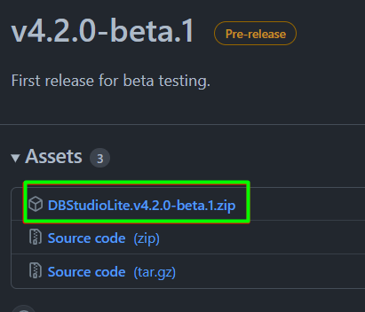

# DBStudioLite

## Introduction
- DBStudioLite is the open source lightweight (< 5 MB if you have .NET runtime already) database management and query organizer tool. 
- This tool currently supports managing SQL Server databases, JSON, and XML files. 
- DBStudioLite populates the schema objects faster and provides easy to use UI to filter the objects.
- The developers can switch between multiple databases and can run the commands against different databases easily. This is especially useful when the developers manage databases in different environments and multi-tenant databases where the schema of these databases would be similar.
- The developers can save the repeatedly used code snippets within the tool and use a single click to execute multiple commands at the same time.
- DBStudioLite uses the ScintillaNet library to provide the code formatting and editing features. It supports rich ‘Find and Replace’ options and incremental search (shortcut Ctrl + I) options.
- DBStudioLite uses ClosedXML and OpenXml frameworks to provide export to excel features. So MS Office license is not required for export functionality. Users can use any Xlsx viewer/editor.
## Further improvements/Work in progress
- DBStudioLite can be automated to generate the data access layer code from the templates.
- DBStudioLite can be expanded to support different databases like Oracle, MySQL, MongoDB, Redis, etc.
- Check the project page for other ongoing feature implementations.
## Dependencies
- This tool runs using .NET 4.8 runtime engine. If the runtime is not installed, it will be automatically downloaded during the DBStudioLite installation.
## Installation
- The binary package can be downloaded from [Releases](https://github.com/tmasabari/DBStudioLite/releases)
  
  
- This is a click-once Windows application. It automatically installs the necessary dependencies.
- After the installation, please add a connection string using Manage Menu.

The syntax of the connection string is data source=SERVERNAME\INSTANCENAME;user id=UserAccountID;password=PASSWORD

Example data source=AzureDB.database.windows.net;user id=MyAdminName;password=MyPassword

## Application Usage
Check the usage from [Wiki](../../wiki) 

## Built With

* [.NET 4.8 Winforms](https://github.com/dotnet/winforms) - The UI framework
* [ScintillaNet](https://github.com/jacobslusser/ScintillaNET) - Souce code editing component
* [ClosedXML](https://github.com/ClosedXML/ClosedXML) - NET library for Excel 2007+ (.xlsx, .xlsm) files. 

## Contributing

Please read [CONTRIBUTING.md](CONTRIBUTING.md) for details on the process for submitting pull requests to us.

Please read [CODE_OF_CONDUCT.md](CODE_OF_CONDUCT.md) for details on our code of conduct.

## Versioning

We use [SemVer](http://semver.org/) for versioning. For the versions available, see the [tags on this repository](https://github.com/tmasabari/DBStudioLite/tags). 

## Authors

* **Sabarinathan Arthanari** - *Initial work* - [tmasabari](https://github.com/tmasabari)

See also the list of [contributors](https://github.com/tmasabari/DBStudioLite/contributors) who participated in this project.

## License

This project is licensed under the GNU Affero General Public License v3.0 - see the [LICENSE](LICENSE) file for details

## Acknowledgments
The answers from online technical portals contributed heavily to learning and achieving the part of this product. We acknowledged the relevant code in the source files themselves.

*  [StackOverflow](https://stackoverflow.com/)
*  [GitHub](https://github.com)
*  [CodeProject](https://www.codeproject.com)
*  [StormRage](http://www.stormrage.com)
*  [RareSQL](https://raresql.com)
